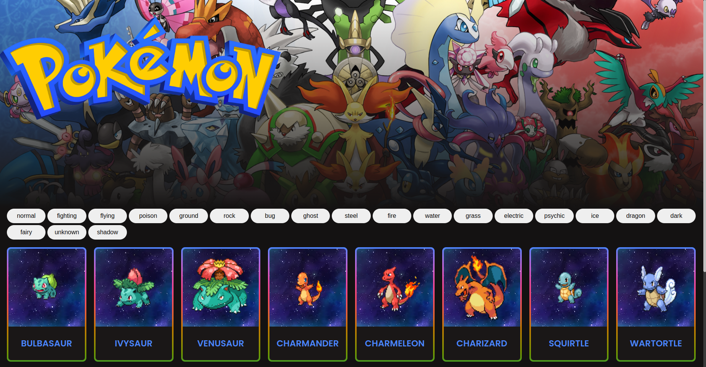
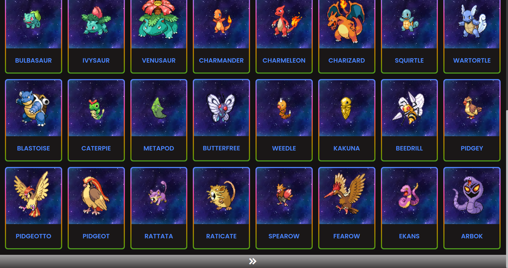
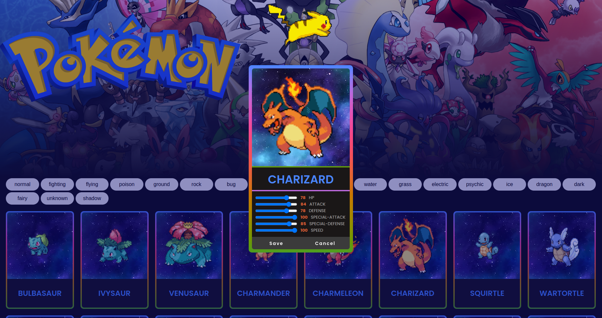

# Pokemon Web App

Este es un proyecto de aplicación web de una Pokédex que te permite explorar información sobre diferentes Pokémon. La aplicación está construida utilizando HTML, CSS y JavaScript, y utiliza la PokeAPI para obtener datos de los Pokémon, ademas permite modificar sus estadisticas guardandose internamente en un JSON Server para luego mostrarlas.

## Contenido del Repositorio

Este repositorio contiene los siguientes archivos:

- `index.html`: El archivo HTML principal que define la estructura de la página web de la Pokédex.

- `style.css`: El archivo CSS que contiene los estilos para la aplicación web.

- `main.js`: El archivo JavaScript principal que maneja la funcionalidad de la aplicación.

- `conexJsonServer.js`: Un módulo JavaScript que maneja la comunicación con una API personalizada para guardar datos de Pokémon.

- `cardsData.js`: Un módulo JavaScript que maneja eventos relacionados con las tarjetas de Pokémon y la obtención de datos detallados.

- `README.md` (este archivo): Una descripción general del proyecto y su contenido.

## API

PokéAPI:

- `https://pokeapi.co/api/v2/pokemon/` _limite 20 por defecto_.
- `https://pokeapi.co/api/v2/pokemon/?offset=0&limit=20` _limitar manualmente, cambia los valores de **offset**: Inicio y **limit**: Final._

## Configuración del Proyecto

A continuación, se muestra cómo configurar y ejecutar el proyecto en tu entorno local:

1. Clona este repositorio en tu máquina local:

   ```shell
   git clone https://github.com/jstorra/pokemonAPI.git
   ```

2. Ejecuta el comando `npm i` para instalar las dependencias necesarias para el funcionamiento del proyecto.

3. Ejecuta el comando `npm run dev` para levantar el servidor y guardar los registros en el archivo db.json.

4. Abre el archivo `index.html` en tu navegador web para ver la Pokédex en acción.

## Estructura del Código

El código de la aplicación se divide en varios módulos para facilitar la organización y el mantenimiento:

- `loadFunctions.js`: Contiene funciones para cargar tipos de Pokémon, tarjetas de Pokémon y acciones relacionadas con las tarjetas.

- `conexJsonServer.js`: Contiene funciones para guardar datos de Pokémon en una fuente de datos personalizada.

- `cardsData.js`: Contiene funciones para manejar eventos relacionados con las tarjetas de Pokémon y la obtención de datos detallados.

- `style.css`: Define los estilos para la aplicación, incluyendo estilos para la página principal y los diálogos emergentes.

## Uso de la Aplicación

La aplicación web de la Pokédex te permite:

- Explorar tarjetas de Pokémon con información básica.

- Hacer clic en una tarjeta para ver detalles más completos del Pokémon.

- Guardar datos de un Pokémon, incluyendo estadísticas personalizadas, en una fuente de datos personalizada.

- Filtrar Pokémon por tipos haciendo clic en los botones de tipos en la parte superior de la página.

## Contribuir

Si deseas contribuir a este proyecto, ¡te animamos a hacerlo! Puedes enviar problemas (issues) y solicitudes de extracción (pull requests) para proponer mejoras o correcciones.

## Screenshots

## 

## 

## 

<p align="center">Developed by <a href="https://github.com/jstorra">@jstorra</a></p>
